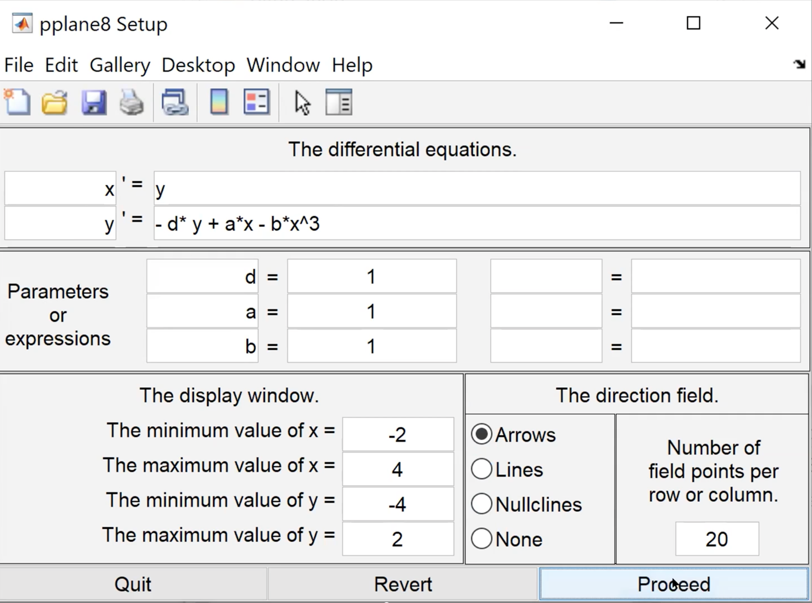
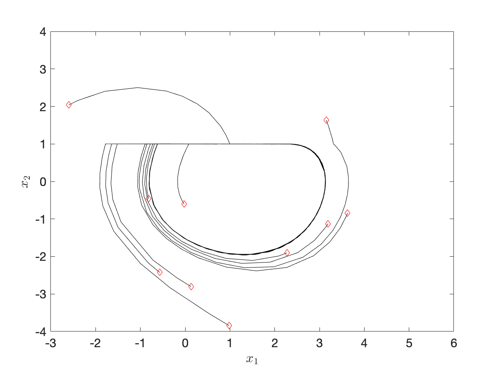
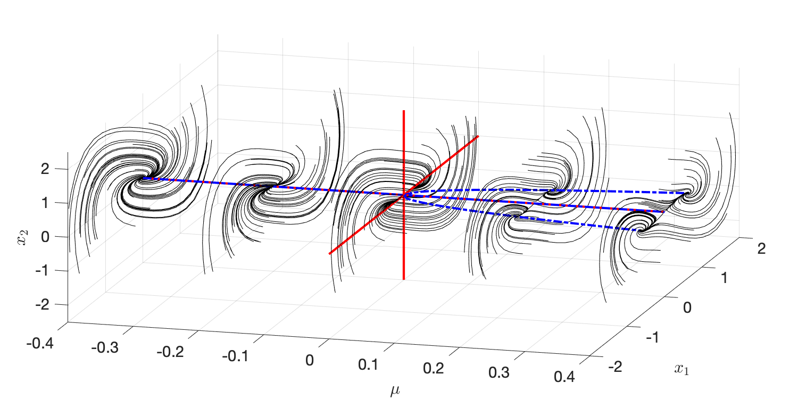

# Phase Portrait and Bifurcation Examples from Lecture 1

## How to use `pplane8.m`
- First, run the code (this might involve a runtime error if you are using a macOS. To fix it, please refer to the matlab file exchange [reviews](https://www.mathworks.com/matlabcentral/fileexchange/61636-pplane).)
- In the GUI, fill in the differential equations you want to play with and click `Proceed`.
- The example we covered in the class is as below:

- For more details, plase refer to [here](https://www.mathworks.com/matlabcentral/fileexchange/61636-pplane).

## Other phase portrait examples
- We created our custom scripts for the phase portrait examples covered in the lecture note and in the textbook Chapter 1 and 2.
- Check out the scripts in `phase_portrait_simulation` and `bifurcation`. Before you run any scripts, make sure to add all the subfolders in the matlab path.
- For instance, run [run_interactive_phase_portrait_violin_string.m](phase_portrait_simulation/run_interactive_phase_portrait_violin_string.m) to run the example covered in Lecture 1.

- You can create your own custom `plant.m` in a similar way to the example plants provided in `plants` directory, and then create a script for running the simulations for the phase portrait, similar to the scripts in `phase_portrait_simulation. This could be useful in your assignments.
- Check out other examples in the folder `bifurcation` as well. For instance, run [run_bifurcation_buckling_beam.m](bifurcation/run_bifurcation_buckling_beam.m) to see the 3D visualization of the buckling beam's bifurcation phase portraits, covered in the class today.

